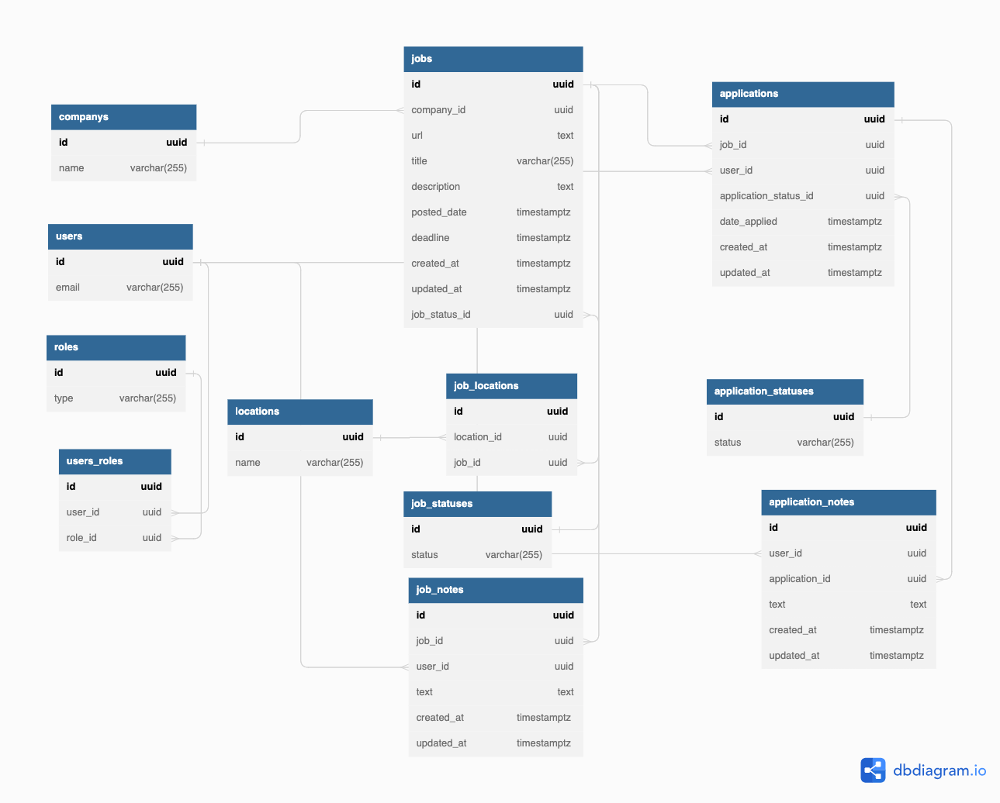

# Job Tracker Backend
## About
The API for a job tracker application. The API will store and serve information that helps users learn what jobs are available and keep track of the job applications they have made.

It will also help users understand who is applying to which jobs, who is applying to jobs most frequently, and how close users are to getting hired.

## User stories
### Companies
- I can see a list of companies
- I can enter a search term to filter the list of companies
- I can sort the companies by name (ascending or descending)
- I can add a company to the list of companies

### Jobs
- I can see a list of jobs.
- I can filter the list of jobs by company, status (open or filled), and location
- A job can have more than one location (ex: Texas and NYC, Chicago and remote)
- I can add a text note about a job.
- I can add a new job to the list of jobs.

### Applications
- I can see who (or how many people) have applied to a specific job.
- I can see a list of jobs I have applied to.
- I can see what jobs another user has applied to.
- I can sort and filter applications by status (applied, got interview, got offer, etc.)
- I can update the status of my application.
- I can add an application to the list.
- I can see a leaderboard of who has applied to the most jobs in the last week / month.

### Notes
- I can add a text note about a job.
- I can add a text note about one of my applications.
- I can delete my notes
- I can see all the notes about a job left by any user.
- I can see all the notes about my application.
- I cannot see the notes on another user's application.

### Admin powers
- I can delete a job, company, or application
- I can mark a job as closed.
- I can merge duplicate jobs and companies.
- I can edit a job or company
- I can delete notes (e.g., for content moderation)

## Endpoints
|Route|Methods|Notes|
|-----|-------|-----|
|`/users`|`GET`, `POST`||
|`/users/:id`|`GET`,`PATCH`, `DELETE`|Delete is admin only|
|`/users/:id/applications`|`GET`||
|`/companys`|`GET`, `POST`||
|`/companys/:id`|`GET`, `DELETE`, `PATCH`|Delete and patch are admin only|
|`/jobs`|`GET`, `POST`||
|`/jobs/:id`|`GET`, `PATCH`, `DELETE`|Write ops are admin only|
|`/jobs/:id/applications`|`GET`||
|`/jobs/:id/job_notes`|`GET`||
|`/applications`|`GET`, `POST`||
|`/applications/:id`|`GET`, `PATCH`, `DELETE`|Write ops are admin only; user can update own entities only|
|`/applications/:id/application_notes`|`GET`||
|`/job_notes`|`GET`, `POST`||
|`/job_notes/:id`|`GET`, `PATCH`, `DELETE`|Write ops are admin only; user can update own entities only|
|`/application_notes`|`GET`, `POST`||
|`/application_notes/:id`|`GET`, `PATCH`, `DELETE`|Write ops are admin only; user can update own entities only|

## Schema
Not pictured: We use a **view** called `applications_joined` to avoid repeating the complicated join query in many endpoints.

We should **read** from the view (`SELECT` from the view) but it is not a real table, so do not use `INSERT` operations with the view.

