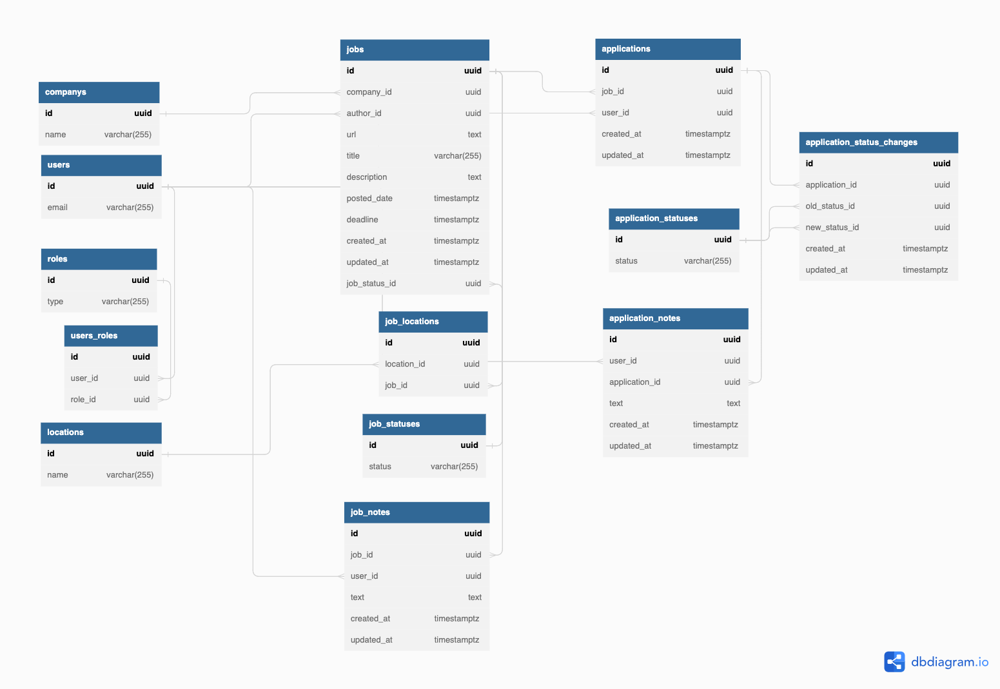

# Job Tracker Backend
## TODOs
1. Schema: add idea of school, cohort, and membership in cohorts
    - `schools` table: `id`, `name`
    - `cohorts` table: `id`, `school_id`, `name` (would include a `staff` cohort, subteams, whatever people need)
    - `user_cohort` table: `id`, `user_id`, `cohort_id`, `start_date` (cannot be null), `end_date` (can be null)
    - augment roles table so roles are per school:
        - `id`
        - `school_id` (NEW)
        - `type`
    - update seed files for above
        - seed schools and cohorts table
        - update `roles` seeds

2. Schema: `job_status_changes` join table
    - similar refactor to `application_status_changes`
    - create the join table: `id`, `job_id`, `created_at`, `old_status_id`, `new_status_id`
    - remove `job_status_id` column from `jobs` table
    - update seed for `jobs` (no `job_status_id` column)
    - create seeds for `job_status_changes` table
    - refactor the view to get the most recent status change: both its name and its date
3. Seed: job notes and application notes

## About
The API for a job tracker application. The API will store and serve information that helps users learn what jobs are available and keep track of the job applications they have made.

It will also help users understand who is applying to which jobs, who is applying to jobs most frequently, and how close users are to getting hired.

## User stories
### Companies
- I can see a list of companies
- I can enter a search term to filter the list of companies
- I can sort the companies by name (ascending or descending)
- I can add a company to the list of companies
- I can edit or delete a company that I added

### Jobs
- I can see a list of jobs.
- I can filter the list of jobs by company, status (open or filled), and location
- A job can have more than one location (ex: Texas and NYC, Chicago and remote)
- I can add a text note about a job.
- I can add a new job to the list of jobs.
- I can edit or delete a job that I added.
- I can see a history of changes to a job's status.

### Applications
- I can see who (or how many people) have applied to a specific job.
- I can see a list of jobs I have applied to.
- I can see what jobs another user has applied to.
- I can sort and filter applications by status (applied, got interview, got offer, etc.)
- I can update the status of my application.
- I can add an application to the list.
- I can edit or delete my own applications.
- I can see a leaderboard of who has applied to the most jobs in the last week / month.
- I can see a history of changes to an application's status.

### Notes
- I can add a text note about a job.
- I can add a text note about one of my applications.
- I can edit or delete my notes.
- I can see all the notes about a job left by any user.
- I can see all the notes about my own applications.
- I cannot see the notes on another user's application.

### Admin powers
- I can delete a job, company, or application
- I can mark a job as closed.
- I can merge duplicate jobs and companies.
- I can edit a job or company
- I can delete notes (e.g., for content moderation)

## About permissions
- In general, a user who creates something should have the power to edit or delete it.
- Admins need write permissions over everything to prevent chaos and keep the data neat.
- There is the potential for bad actions, for example marking a job as "closed" so no one 
other users have the opportunity to apply for it. We can mitigate this by:
    - not letting users edit an job or application they didn't create (they can add a note instead)
    - allowing admins write permissions to correct malicious actions like this

## Endpoints
|Route|Methods|Notes|
|-----|-------|-----|
|`/users`|`GET`, `POST`||
|`/users/:id`|`GET`,`PUT`, `DELETE`|Delete is admin only|
|`/users/:id/applications`|`GET`||
|`/companys`|`GET`, `POST`||
|`/companys/:id`|`GET`, `DELETE`, `PUT`|Delete and put are admin only|
|`/jobs`|`GET`, `POST`||
|`/jobs/:id`|`GET`, `PUT`, `DELETE`|Write ops are admin only|
|`/jobs/:id/applications`|`GET`||
|`/jobs/:id/job_notes`|`GET`||
|`/applications`|`GET`, `POST`||
|`/applications/:id`|`GET`, `PUT`, `DELETE`|Write ops are admin only; user can update own entities only|
|`/applications/:id/application_notes`|`GET`||
|`/job_notes`|`GET`, `POST`||
|`/job_notes/:id`|`GET`, `PUT`, `DELETE`|Write ops are admin only; user can update own entities only|
|`/application_notes`|`GET`, `POST`||
|`/application_notes/:id`|`GET`, `PUT`, `DELETE`|Write ops are admin only; user can update own entities only|

## Schema
Not pictured: We use a **view** called `applications_joined` to avoid repeating the complicated join query in many endpoints. There is also a similar `jobs_joined` view.

We should **read** from the view (`SELECT` from the view) but it is not a real table, so do not use `INSERT` or `UPDATE` operations with the view.

